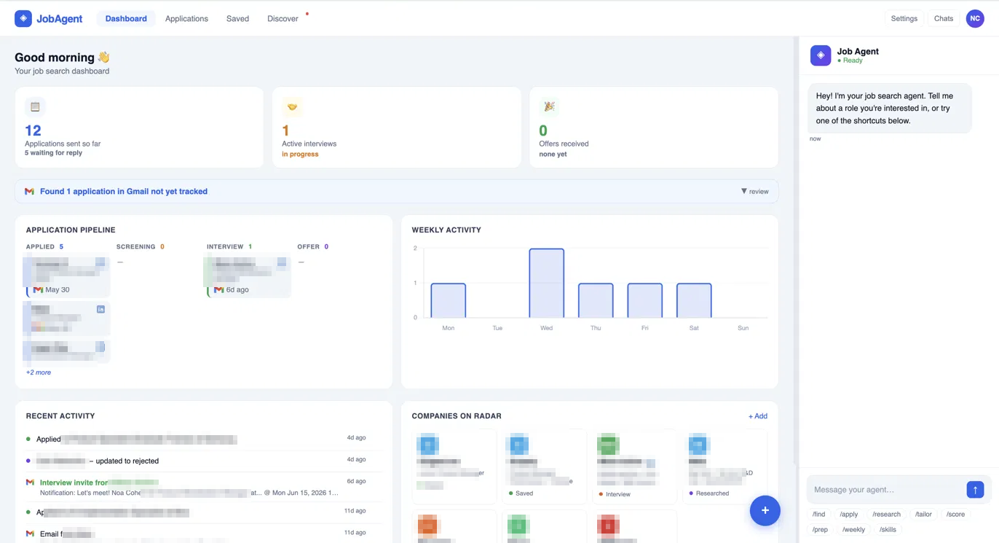

# JobAgent



A personal AI job search agent with a web dashboard, built on the [Claude Agent SDK](https://www.npmjs.com/package/@anthropic-ai/claude-agent-sdk). Chat naturally to track applications, discover new roles, score your resume fit, tailor materials, and run mock interviews — all from a single local UI.

**Uses your Claude subscription — no separate API key needed.**

---

## What it does

- **Job discovery** — searches LinkedIn, Comeet, and Drushim for open roles matching your target; save any result with one click
- **ATS resume fit score** — scores your resume against a saved JD (0–100) and shows missing keywords before you apply
- **Resume tailoring** — rewrites your summary and bullets for each role, without touching your master copy
- **Application pipeline** — track every role from Applied → Screening → Interview → Offer with a Kanban view
- **Company detail panel** — research notes, ATS score, mock interview, personal notes, and saved contacts per company
- **Mock interviews** — interactive Q&A tailored to the role and your resume, with per-answer feedback
- **Weekly pipeline review** — flags stale applications, suggests follow-ups, surfaces 3 new targets
- **Skill gap tracker** — scans all your saved JDs for recurring skills you're missing, updates a learning plan
- **Contact tracking** — save referral contacts per company; shown on applications and company cards
- **Chat history** — archive and resume past conversations
- **Persistent memory** — agent re-orients itself on every session start
- **All data stays local** — resume, applications, and notes never leave your machine

---

## Quick start

**Requirements:** [Claude Code](https://claude.ai/code) installed and authenticated.

```bash
# 1. Clone and install
git clone https://github.com/NoaCohen-13/job-search-agent
cd job-search-agent
npm install

# 2. Set your profile
cp config.example.json config.json
# Edit config.json — fill in your name, email, target role, location, and industries
# The agent uses this to personalize research, tailoring, and discovery

# 3. Add your resume
# Save your resume as workspace/resume/base_resume.md (plain text or Markdown)
# The agent never modifies this file — tailored copies are saved per application

# 4. Start
npm start
# Open http://localhost:3000
```

On first run, the app shows a short onboarding to confirm your target role and location. These sync back to `config.json` automatically.

---

## Tabs

| Tab | What's there |
|-----|-------------|
| **Dashboard** | Pipeline overview, weekly activity chart, companies on radar, activity feed |
| **Discover** | Job search across LinkedIn, Comeet, and Drushim — save roles with one click |
| **Applications** | All applied roles with status, dates, and quick actions |
| **Saved** | Jobs saved from Discover (pre-application) and manually researched companies |

---

## Commands

| Command | What it does |
|---------|-------------|
| `/find [role] [location]` | Search LinkedIn, Comeet, and Drushim for open roles |
| `/score [company]` | Score your resume against a saved JD (0–100) with keyword gap analysis |
| `/tailor [company]` | Rewrite your resume for a specific role |
| `/research [company]` | Web research → structured notes saved to workspace |
| `/prep [company]` | Tailored interview questions + STAR answer structures |
| `/weekly` | Pipeline review, stale app flags, 3 new targets |
| `/skills` | Scan all saved JDs for recurring skill gaps, update learning plan |

Or just talk: *"I applied to APM at Monday.com"*, *"Research Wix for me"*, *"What should I follow up on?"*

---

## Workspace structure

All your personal data lives in `workspace/` (gitignored):

```
workspace/
├── resume/
│   └── base_resume.md        ← master resume — agent never modifies this
├── applications/
│   └── [company]/
│       ├── job_description.md
│       ├── tailored_resume.md
│       ├── cover_letter.md
│       ├── research.md
│       ├── interview_notes.md
│       └── ats_score.json
├── companies/                 ← saved jobs and pre-application research
│   └── [company-role]/
│       ├── job_description.md
│       └── ats_score.json
├── discover/
│   └── latest.json            ← most recent /find results
├── courses/
│   └── learning_plan.md       ← auto-updated skill gap tracker
├── notes/
│   └── weekly_reviews/
└── memory/                    ← agent's persistent memory across sessions
```

---

## Stack

- [Claude Agent SDK](https://www.npmjs.com/package/@anthropic-ai/claude-agent-sdk) — agentic runtime (wraps Claude Code)
- [Express](https://expressjs.com/) + SSE — server + streaming
- Vanilla JS + [Chart.js](https://www.chartjs.org/) — frontend, no build step

---

## License

MIT
